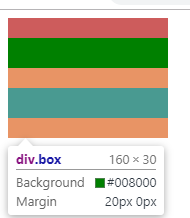
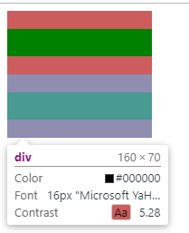

## 初识BFC

### 概念

BFC（Block Formatting Context）格式化上下文，是Web页面中盒模型布局的CSS渲染模式，指一个独立的渲染区域或者说是一个隔离的独立容器。

### 布局规则

- 在BFC下，内部的box会在垂直方向一个一个的放置
- box垂直方向的距离由margin决定，属于同一BFC的两个相邻Box的margin会发生重叠
- 在BFC中，每一个盒子的左外边缘（margin-left）会触碰到容器的左边缘(border-left)（对于从右到左的格式来说，则触碰到右边缘），即使存在浮动也是如此
- BFC的区域不会与float box重叠
- BFC就是页面上的一个隔离的独立容器，容器里面的子元素不会影响到外面的元素
- 计算BFC的高度时，浮动元素也参与计算

###  形成BFC的条件

- 浮动元素，float 除 none 以外的值
- 定位元素，position不为static和relative（absolute，fixed）
- display 为以下其中之一的值 inline-block，table-cell，table-caption
- overflow 除了 visible 以外的值（hidden，auto，scroll）

## BFC使用场景

### 解决边距重叠问题

```html
<div class="wrap">
    <div class="box"></div>
    <div class="box"></div>
  </div>
```

```css
 .wrap {
      width: 160px;
      overflow: hidden;
      background: indianred;
    }
    .box {
      height: 30px;
      margin: 20px 0;
      background: green
    }
```




由上可见同一个BFC的两个相邻元素的margin会发生重叠(**特性2**)，我们可以在其中一个元素外面包裹一层容器，并触发该容器生成一个BFC，那么两个元素便属于不同的BFC，就不会发生margin重叠了。

```html
  <div class="wrap">
    <div class="box"></div>
    <div style="overflow: hidden">
      <div class="box"></div>
    </div>
  </div>
```



###  解决浮动问题

我们经常给父元素设置overflow:hidden来清除子元素的浮动，但原理是什么？

```html
<div class="parent">
    <div class="child"></div>
  </div>
```

```css
    .parent {
      width: 200px;
      border: 1px solid #ccc;
    }
    .child {
      float: left;
      width: 100px;
      height: 100px;
      background: #3BD49E;
    }
```


可以看到parent 没有创建BFC，发生了高度坍塌，我们做如下更改，给parent创建BFC，计算BFC元素高度的时候，浮动元素也参与了计算（**特性5**）

```css
    .parent {
      width: 200px;
      border: 1px solid #ccc;
      overflow: hidden;
    }
```


### 解决侵占浮动元素的问题

浮动元素会脱离文档流，然后浮盖在文档流元素上

```html
  <div class="box1"></div>
  <div class="box2"></div>
```

```css
    .box1 {
      float: left;
      width: 100px;
      height: 100px;
      background: #3BD49E
    }
    .box2 {
      width: 200px;
      height: 200px;
      background: palevioletred
    }
```


作如下更改：

```css
    .box2 {
      width: 200px;
      height: 200px;
      overflow: hidden;
      background: palevioletred
    }
	/*或者*/
	.box2 {
      width: 200px;
      height: 200px;
      float: left;
      background: palevioletred
    }
```


我们为非浮动元素建立BFC环境，根据BFC的不与float box重叠的规则(**特性4**)，解决了侵占元素问题。

## 总结
BFC就是页面上的一个隔离的独立容器，容器里面的子元素不会影响到外面的元素。反之也如此

## 参考资料

- [CSS深入理解流体特性和BFC特性下多栏自适应布局](<https://www.zhangxinxu.com/wordpress/2015/02/css-deep-understand-flow-bfc-column-two-auto-layout/>)
- [CSS中的BFC详解](<http://www.cnblogs.com/chen-cong/p/7862832.html>)
- [CSS: 潜藏着的BFC](<https://segmentfault.com/a/1190000012221820>)
- [BFC 神奇背后的原理](<http://www.cnblogs.com/lhb25/p/inside-block-formatting-ontext.html>)

