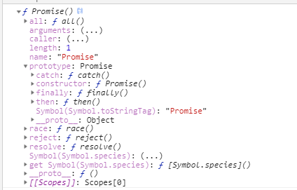

##  概念
- `Promise`是ES6中新增的一种异步编程的方式，用于解决回调的方式的各种问题，提供了更多的可能性
- 我们在打印console.dir(Promise)，可以看到promise是一个构造函数，自身有`all`、`race`、`reject`、`resolve`等方法，原型上含有`then`、`catch`等方法。



### 基本用法

新建一个promise对象, 它接受一个函数作为参数，并且会返回`promise对象`

```js
var promise = new Promise(function(resolve, reject) {
  if (/* 异步操作成功 */){
    resolve(value);
  } else {
    reject(error);
  }
});
promise.then(function(value) {
  // 如果调用了resolve方法，执行此函数
}, function(value) {
  // 如果调用了reject方法，执行此函数
});
```

Promise 对象有三种状态，他们分别是：

- pending: 等待中，或者进行中，表示还没有得到结果
- resolved(Fulfilled): 已经完成，表示得到了我们想要的结果，可以继续往下执行
- rejected: 也表示得到结果，但是由于结果并非我们所愿，因此拒绝执行

这三种状态不受外界影响，而且状态只能从 `pending` 改变为 `resolved` 或者`rejected` ，并且不可逆。在 `Promise` 对象的构造函数中，`resolve` 和 `reject` 就是用来处理Promise的状态变化。

一般来说，调用 `resolve` 或 `reject` 以后，Promise 的使命就完成了，后继操作应该放到 `then` 或者 `catch` 方法里面，而不应该直接写在 `resolve()` 或 `reject()` 的后面 


## API
### Promise#then

promise.then(onFulfilled, onRejected);

```js
var promise = new Promise(function(resolve, reject){
    resolve("传递给then的值");
});
promise.then(function (value) {
    console.log(value);
}, function (error) {
    console.error(error);
});
```

这段代码创建一个promise对象，定义了处理onFulfilled和onRejected的函数（handler），然后返回这个promise对象。

这个promise对象会在变为resolve或者reject的时候分别调用相应注册的回调函数。

- 当handler返回一个正常值的时候，这个值会传递给promise对象的onFulfilled方法。
- 定义的handler中产生异常的时候，这个值则会传递给promise对象的onRejected方法。

### Promise#catch

promise.catch(onRejected);

```js
var promise = new Promise(function(resolve, reject){
    resolve("传递给then的值");
});
promise.then(function (value) {
    console.log(value);
}).catch(function (error) {
    console.error(error);
});
```

这是一个等价于`promise.then(undefined, onRejected)` 的语法糖。

### Promise.resolve

Promise.resolve(promise);
Promise.resolve(thenable);
Promise.resolve(object);

```js
var taskName = "task 1"
asyncTask(taskName).then(function (value) {
    console.log(value);
}).catch(function (error) {
    console.error(error);
});
function asyncTask(name){
    return Promise.resolve(name).then(function(value){
        return "Done! "+ value;
    });
}
```

- 接收到promise对象参数的时候,返回的还是接收到的promise对象

- 接收到thenable类型的对象的时候,返回一个新的promise对象，这个对象具有一个 `then` 方法

- 接收的参数为其他类型的时候（包括JavaScript对或null等）返回一个将该对象作为值的新promise对象

### Promise.reject

Promise.reject(object)

### Promise.all

Promise.all(promiseArray);

```js
var p1 = Promise.resolve(1),
    p2 = Promise.resolve(2),
    p3 = Promise.resolve(3);
Promise.all([p1, p2, p3]).then(function (results) {
    console.log(results);  // [1, 2, 3]
});
```

- 生成并返回一个新的promise对象。

- 参数传递promise数组中所有的promise对象都变为resolve的时候，该方法才会返回， 新创建的promise则会使用这些promise的值。

- 如果参数中的任何一个promise为reject的话，则整个Promise.all调用会立即终止，并返回一个reject的新的promise对象。

- 由于参数数组中的每个元素都是由 `Promise.resolve` 包装（wrap）的，所以Paomise.all可以处理不同类型的promose对象。

### Promise.race

Promise.race(promiseArray);

```js
var p1 = Promise.resolve(1),
    p2 = Promise.resolve(2),
    p3 = Promise.resolve(3);
Promise.race([p1, p2, p3]).then(function (value) {
    console.log(value);  // 1
});
```

- 生成并返回一个新的promise对象。

- 参数 promise 数组中的任何一个promise对象如果变为resolve或者reject的话， 该函数就会返回，并使用这个promise对象的值进行resolve或者reject。

## 错误用法及误区

### 没有返回值

```js
loadAsync1()
.then(function(data1) {
	loadAsync2(data1)
})
.then(function(data2){
	loadAsync3(data2)
})
.then(res=>console.log(res))
```

promise 的神奇之处在于让我们能够在回调函数里面使用 return 和 throw， 所以在then中可以return出一个promise对象或普通的值，也可以throw出一个错误对象，但如果没有任何返回，将默认返回 undefined，那么后面的then中的回调参数接收到的将是undefined，而不是上一个then中内部函数 loadAsync2 执行的结果，后面都将是undefined。

### 没有catch

```js
loadAsync1()
	.then(function(data1) {
		return loadAsync2(data1)
	})
	.then(function(data2){
	    return loadAsync3(data2)
	})
	.then(okFn, failFn)
```

这里的调用，并没有添加catch方法，那么如果中间某个环节发生错误，将不会被捕获，控制台将看不到任何错误，不利于调试查错，所以最好在最后添加catch方法用于捕获错误。

添加catch

```js
loadAsync1()
	.then(function(data1) {
		return loadAsync2(data1)
	})
	.then(function(data2){
	    return loadAsync3(data2)
	})
	.then(okFn, failFn)
	.catch(err=>console.log(err))
```

### catch()与then(null, fn)

在有些情况下catch与then(null, fn)并不等同，如下

```js
ajaxLoad1()
	.then(res=>{ return ajaxLoad2() })
	.catch(err=> console.log(err))
```

### 断链 The Broken Chain

```js
function loadAsyncFnX(){ return Promise.resolve(1); }
function doSth(){ return 2; }

function asyncFn(){
	var promise = loadAsyncFnX()
    promise.then(function(){
		return doSth();
    })
	return promise;
}

asyncFn().then(res=>console.log(res)).catch(err=>console.log(err))
```

上面这种用法，从执行结果来看，then中回调的参数其实并不是doSth()返回的结果，而是loadAsyncFnX()返回的结果，catch 到的错误也是 loadAsyncFnX()中的错误，所以 doSth() 的结果和错误将不会被后而的then中的回调捕获到，形成了断链，因为 then 方法将返回一个新的Promise对象，而不是原来的Promise对象。

改写如下：

```js
function loadAsyncFnX(){ return Promise.resolve(1); }
function doSth(){ return 2; }

function asyncFn(){
	var promise = loadAsyncFnX()
    return promise.then(function(){
		return doSth();
    })
}

asyncFn().then(res=>console.log(res)).catch(err=>console.log(err))
// 2
```

### 穿透 Fall Through

```js
new Promise(resolve=>resolve(8))
  .then(1)
  .catch(null)
  .then(Promise.resolve(9))
  .then(res=> console.log(res))
// 8
```

这里，如果then或catch接收的不是函数，那么就会发生穿透行为，所以在应用过程中，应该保证then接收到的参数始终是一个函数。

### 长度未知的串行与并行

```js
getAsyncArr()
	.then(promiseArr=>{
		var resArr = [];
		promiseArr.forEach(v=>{
			v().then(res=> resArr.push(res))
		})
		return resArr;
	})
	.then(res=>console.log(res))
```

使用forEach遍历执行promise，在上面的实现中，第二个then有可能拿到的是空的结果或者不完整的结果，因为，第二个then的回调无法预知 promiseArr 中每一个promise是否都执行完成，那么这里可以使用 Promise.all 结合 map 方法去改善

```js
getAsyncArr()
	.then(promiseArr=>{
		return Promise.all(promiseArr);
	})
	.then(res=>console.log(res))
```

如果需要串行执行，那和我们可以利用数据的reduce来处理串行执行

```js
var pA = [
	function(){return new Promise(resolve=>resolve(1))},
	function(data){return new Promise(resolve=>resolve(1+data))},
	function(data){return new Promise(resolve=>resolve(1+data))}
]

pA.reduce((prev, next)=>prev.then(next).then(res=>res),Promise.resolve())
.then(res=>console.log(res))
// 3
```

## 总结

- then方法提供一个供自定义的回调函数，若传入非函数，则会忽略当前then方法。
- 回调函数中会把上一个then中返回的值当做参数值供当前then方法调用。
  then方法执行完毕后需要返回一个新的值给下一个then调用（没有返回值默认使用undefined）。
- 每个then只可能使用前一个then的返回值。

## 参考资料

- [通俗浅显的理解Promise中的then](<https://segmentfault.com/a/1190000010420744>)
- [promises 很酷，但很多人并没有理解就在用了](<http://web.jobbole.com/82601/>)
- [深入理解ES6里的promise](<https://www.cnblogs.com/goloving/p/8045131.html>)
- [JavaScript Promise迷你书（中文版）](<http://liubin.org/promises-book/#ch2-promise.then>)

- [Promise.prototype.then()
](<https://developer.mozilla.org/zh-CN/docs/Web/JavaScript/Reference/Global_Objects/Promise/then>)