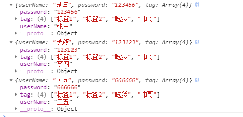
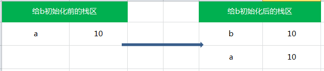
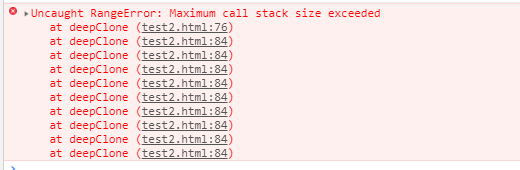
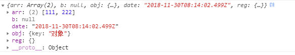
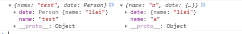
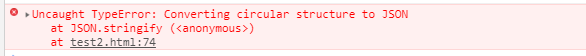

# 深浅拷贝
把一个对象里面的东西一模一样地复制到另一个对象，并且这两个对象分别放在内存的不同地方，这就叫拷贝。如果只复制了基本类型，引用类型仍然指向同一个地址，就是浅拷贝；如果引用类型也指向不同地址，那就是深拷贝。

##  一个简单的示例
我们希望给每一个注册用户建立一个数据模型，在此之前，我们要把这个用户的数据模型模板给创建出来：

```js
let userTemp = {
    userName: '张三',
    password: '123456',
    tag: ['标签1','标签2']
}
```

现在来了一个新用户来注册，用这个模板对象复制一个新对象来,写一个函数，把userTemplate对象的每一个属性都复制到这个新对象里，代码是这样的：

```js
function extendCopy(initalObj) {
    const obj = {};
    for ( let i in initalObj) {
        if (initalObj.hasOwnProperty(i)) {
            obj[i] = initalObj[i];
        }
    }
    return obj
}
let user1 = extendCopy(userTemp)
user1.userName = '李四'
user1.password = '123123'
user1.tag.push('吃货')
```

然后我们又来了一位用户,于是我们用刚才写的函数新复制一个对象：

```js
let user2 = extendCopy(userTemp)
user2.userName = '王五'
user2.password = '666666'
user2.tag.push('帅哥')
```

下面我在把模型插入数据库之前，我要打印出来三个对象看看内容是不是正确，打印的结果是这样的:



可以看到，数组属性出现了问题，3个对象的数组属性都一样。因为简单的复制对象，如果对象其中一个属性是引用型变量，就会出现这种情况，因为引用型变量保存的是内存地址，所以其实后来操作的都是同一块内存，导致了数组内容都一样。

##  深拷贝vs浅拷贝

其实深拷贝和浅拷贝都是针对的引用类型，JS中的变量类型分为值类型（基本类型）和引用类型；对值类型进行复制操作会对值进行一份拷贝，而对引用类型赋值，则会进行地址的拷贝，最终两个变量指向同一份数据

### 内存分析
基本数据类型保存在栈内存，形式如下：栈内存中分别存储着变量的标识符以及变量的值

```js
var a = 10;
var b = a;

a ++ ;
console.log(a); // 11
console.log(b); // 10
```


所以说，基本类型的赋值的两个变量是两个独立相互不影响的变量

但是引用类型的赋值是传址, 只是改变指针的指向，也就是说引用类型的赋值是对象保存在栈中的地址的赋值，这样的话两个变量就指向同一个对象，因此两者之间操作互相有影响。

```js
var a = {}; // a保存了一个空对象的实例
var b = a;  // a和b都指向了这个空对象

a.name = 'jozo';
console.log(a.name); // 'jozo'
console.log(b.name); // 'jozo'

b.age = 22;
console.log(b.age);// 22
console.log(a.age);// 22
console.log(a == b);// true

```


##  实现浅拷贝
###  直接遍历
```js
function extendCopy(initalObj) {
    const obj = {};
    for ( let i in initalObj) {
        if (initalObj.hasOwnProperty(i)) {  //  避免列举出原型上的属性
            obj[i] = initalObj[i];
        }
    }
    return obj
}
```
### slice/concat
```js
const array = [1, 2, 3, 4];
const copyArray = array.slice();
copyArray[0] = 100;
console.log(array); // [1, 2, 3, 4]
console.log(copyArray); // [100, 2, 3, 4]
```
### Object.assign
```js
const a = {name:"jack",age:20};
const b = Object.assign({},a);
```

### ES6扩展运算符
```js
const originArray = [1,2,3,4,5,[6,7,8]];
const originObj = {a:1,b:{bb:1}};

const cloneArray = [...originArray];
cloneArray[0] = 0;
cloneArray[5].push(9);
console.log(originArray); // [1,2,3,4,5,[6,7,8,9]]

const cloneObj = {...originObj};
cloneObj.a = 2;
cloneObj.b.bb = 2;
console.log(originObj); // {a:1,b:{bb:2}}
```

## 实现深拷贝

###  递归
利用 **递归** 来实现深复制，**对属性中所有引用类型的值，遍历到是基本类型的值为止**
```js
function deepClone(source){
  if(!source && typeof source !== 'object'){
    throw new Error('error arguments', 'shallowClone');
  }
  var targetObj = Array.isArray(source) ? [] : {};
  for(var keys in source){
    if(source.hasOwnProperty(keys)){
      if(source[keys] && typeof source[keys] === 'object'){
        targetObj[keys] = deepClone(source[keys]);    //递归
      }else{
        targetObj[keys] = source[keys];
      }
    }
  }
  return targetObj;
}
```

```js
function deepClone(initalObj, finalObj) {
  var obj = finalObj || {};
  for (var i in initalObj) {
    var prop = initalObj[i];
      // 避免相互引用对象导致死循环，如initalObj.a = initalObj的情况
    //if(prop === obj) {
     // continue;
    //}
    if (typeof prop === 'object') {
      obj[i] = (prop.constructor === Array) ? [] : {};
      arguments.callee(prop, obj[i]);
    } else {
      obj[i] = prop;
    }
  }
  return obj;
}
var str = {};
var obj = { a: {a: "hello", b: 21} };
deepClone(obj, str);
```
> 现在已经不推荐使用arguments.callee()
> 原因：访问 arguments 是个很昂贵的操作，因为它是个很大的对象，每次递归调用时都需要重新创建。影响现代浏览器的性能，还会影响闭包。
> 在严格模式下，禁用了该属性（arguments.callee）

> 如果对象中存在循环引用的情况无法正确实现深拷贝




### JSON对象的parse和stringify

```js
function deepClone(obj){
    let _obj = JSON.stringify(obj),
        objClone = JSON.parse(_obj);
    return objClone
}
let a=[0,1,[2,3],4],
    b=deepClone(a);
a[0]=1;
a[2][0]=1;
console.log(a,b);  //a:[1,1,[1,3],4]  b:[0,1,[2,3],4]
```
>如果obj里有函数，undefined，时间对象，RegExp，NaN，则序列化的结果会把函数或 undefined丢失,时间对象序列化的结果将得到字符串，RegExp序列化的结果将只得到空对象，NaN序列化的结果会变成null

```js
const obj = {
	arr: [111, 222],
	b:NaN,
	c:undefined,
	obj: {key: '对象'},
	a: () => {console.log(函数)},
	date: new Date(),
	reg: /正则/ig
}
```



> JSON.stringify()只能序列化对象的可枚举的自有属性，例如 如果obj中的对象是有构造函数生成的， 则使用JSON.parse(JSON.stringify(obj))深拷贝后，会丢弃对象的constructor

```js
function Person(name) {
	this.name = name;
	console.log(name)
}

const liai = new Person('liai');

const test = {
	name: 'a',
	date: liai,
};
const copyed = JSON.parse(JSON.stringify(test));
test.name = 'test'
console.log(test, copyed)
```



> 如果对象中存在循环引用的情况也无法正确实现深拷贝

```js
const source = {}
source.a = source
console.log(JSON.parse(JSON.stringify(source)))
```



**循环引用**解决方案：

1. 自身循环引用

```js
function deepClone(initalObj, finalObj = null) {
    var obj = {}, _parent = finalObj;
    //该字段有父级则需要追溯该字段的父级
    while(_parent) {
        console.log(_parent)
        //如果该字段引用了它的父级，则为循环引用
        if(_parent.originParent === initalObj) {
            //循环引用返回同级的新对象
            return _parent.currentParent;
        }
        _parent = _parent.parent
    }
    for (var i in initalObj) {
        var prop = initalObj[i];
        if (typeof prop === 'object') {
            obj[i] = (prop.constructor === Array) ? [] : {};
            // 递归执行深拷贝 将同级的待拷贝对象与新对象传递给 parent 方便追溯循环引用
            obj[i] = deepClone(prop, {
                originParent: initalObj,
                currentParent: obj,
                parent: finalObj
            });
        } else {
            obj[i] = prop;
        }
    }
    return obj;
}
```
2. 多个对象互相引用

 ```js
var A = {
	B: {
    	name: 'b'
	},
	C: {
		name: 'c'
	},
	D: {

	}
};
A.D.E = A.B;
 ```

此时 A.D.E 与 A.B 是相等的，因为他们引用了同一个对象：

```javascript
console.log(A.B === A.D.E) // 输出： true
```

如果再调用刚才的deepClone函数深拷贝一份对象A的副本X：

```javascript
var X = deepClone(A);
console.log(X.B); // 输出： {name: "b"}
console.log(X.D.E);// 输出: {name: "b"}
console.log(X.B === X.D.E); // 输出： false
```

虽然 X.B 和 X.D.E在字面意义上是相等的，但二者并不是引用的同一个对象，这点上来看对象 X和对象A还是有差异的。这种情况是因为 A.B 并不在 A.D.E 的父级对象链上，所以DeepCopy函数就无法检测到A.D.E对A.B也是一种引用关系，所以DeepCopy函数就将A.B深拷贝的结果赋值给了 X.D.E。

可以使用一个WeakMap结构存储已经被拷贝的对象，每一次进行拷贝的时候就先向WeakMap查询该对象是否已经被拷贝，如果已经被拷贝则取出该对象并返回，将deepCopy函数改造成如下：

```js
function deepCopy(obj, hash = new WeakMap()) {
    if(hash.has(obj)) return hash.get(obj)
    let cloneObj = Array.isArray(obj) ? [] : {}
    hash.set(obj, cloneObj)
    for (let key in obj) {
        cloneObj[key] = isObj(obj[key]) ? deepCopy(obj[key], hash) : obj[key];
    }
    return cloneObj
}

```
**WeakMap** [文档地址](https://developer.mozilla.org/zh-CN/docs/Web/JavaScript/Reference/Global_Objects/WeakMap)
**MDN 结构化克隆算法** [文档地址](https://developer.mozilla.org/zh-CN/docs/Web/Guide/API/DOM/The_structured_clone_algorithm)

**原型引用**解决方案：

```js
function deepClone(obj, hash = new WeakMap()) {
    if(hash.has(obj)) return hash.get(obj)
    let cloneObj = Array.isArray(obj) ? [] : {}
    hash.set(obj, cloneObj)
    for (let i in obj) {
        var prop = obj[i];
        if (typeof prop === 'object') {
            cloneObj[i] = (prop.constructor === Array) ? [] : Object.create(prop);
        } else {
            cloneObj[i] = prop;
        }
    }
    return cloneObj;
}
```
Object.create(prototype, descriptors)  创建一个具有指定原型且可选择性地包含指定属性的对象

###  lodash — _.clone() / _.cloneDeep()
[文档地址](https://lodash.com/docs/4.17.11#clone)
[lodash github源码](https://github.com/lodash/lodash/blob/4.17.4/lodash.js#L11101)

lodash深拷贝——这个算是这几个里面最完善的方法了，日期，函数，正则对象通通都能复制。
在lodash中关于复制的方法有两个，分别是_.clone()和_.cloneDeep()。其中_.clone(obj, true)等价于_.cloneDeep(obj)。


### jquery中的$.extend
```js
var copiedObject = jQuery.extend({}, originalObject) // shallow copy浅复制
var copiedObject = jQuery.extend(true, {}, originalObject) // deep copy深复制
```

## 总结
- 对于单层结构，用上面的浅拷贝方式即可
- 日常深拷贝，建议序列化反序列化方法
- 对于复杂需求，可用lodash深拷贝


##  参考资料
- [js对象克隆之谜](http://b-sirius.me/2017/08/26/js%E5%AF%B9%E8%B1%A1%E5%85%8B%E9%9A%86%E4%B9%8B%E8%B0%9C/)
- [深拷贝的终极探索（99%的人都不知道）](https://segmentfault.com/a/1190000016672263#articleHeader0)
- [JavaScript深拷贝的一些坑](https://yq.aliyun.com/articles/610052)
- [深入剖析 JavaScript 的深复制](http://jerryzou.com/posts/dive-into-deep-clone-in-javascript/)
- [JavaScript 深拷贝性能分析](https://segmentfault.com/a/1190000013107871)
- [WeakMap](https://developer.mozilla.org/zh-CN/docs/Web/JavaScript/Reference/Global_Objects/WeakMap)
- [MDN 结构化克隆算法](https://developer.mozilla.org/zh-CN/docs/Web/Guide/API/DOM/The_structured_clone_algorithm)
- [关于Redux框架,Reducer中state处理方式的探讨](https://www.jianshu.com/p/8287a1dd8ae9)
- [不可变更新模式](http://cn.redux.js.org/docs/recipes/reducers/ImmutableUpdatePatterns.html)
